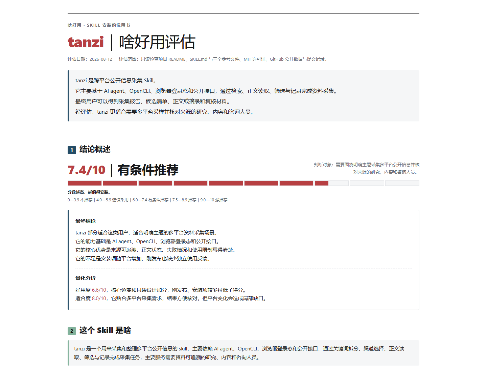

# tanzi（探子）

> 给 Claude Code、Codex、WorkBuddy 等 AI agent 使用的跨平台公开信息采集 Skill。

[](LICENSE)
[](https://agentskills.io/)
[](#持续更新)

`tanzi` 是“探子”的拼音。取这个名字，是因为它做的不是坐在一个搜索框里等答案，而是带着明确问题去不同平台探路：先找线索，再读正文，记录来源，也把没找到、没登录和工具报错如实带回来。

它适合围绕一个主题做多平台采样，最终交付可追溯的候选清单、许可范围内的正文或摘录、采集报告和脱敏响应。用户明确点名探子并限定单平台时，也按指定范围采集。它不负责写成稿，也不执行发帖、评论、点赞等平台写操作。

## 为什么做 tanzi

公开信息采集最麻烦的部分，通常不是“搜一下”，而是下面这些琐碎但关键的工作：

- 同一个问题要换几组中英文关键词。
- 不同平台需要不同的搜索、正文读取和登录方式。
- 搜索结果有标题，不一定代表已经读到正文。
- 一个平台失败，不应该让整次采集全部停摆。
- 社区讨论可以说明关注点，却不能冒充总体统计。
- 最终材料还要留下链接、时间、互动数据和失败记录，方便复核。

`tanzi` 把这些步骤整理成一套可重复执行的采集流程，让 AI agent 知道去哪里找、怎样验证、什么时候降级，以及最后怎样交付。

## 适合谁

- 行业研究、市场研究和咨询人员：需要跨平台找公开资料、案例和讨论信号。
- 内容策划、编辑和创作者：需要为选题、文章或视频准备可回查的素材池。
- 产品、品牌和运营人员：需要观察产品反馈、用户讨论和传播话题。
- 开发者和技术研究者：需要同时查看论文、代码、技术社区和产品资料。
- 重视来源的人：不满足于一段搜索摘要，希望知道正文是否真的取得、结论能支持到什么程度。

以下任务不需要启动 tanzi：

- 只查一个事实或读取一个已经给出的网址。
- 直接撰写公众号文章、研究报告正文或营销文案。
- 自动发帖、评论、点赞、收藏、关注或运营账号。
- 绕过登录、验证码、平台风控或内容访问权限。

## 它怎样工作

```text
明确问题
  → 沿用已有搜索计划，或按需设计关键词与搜索范围
  → 选择最小够用的平台组合
  → 检查工具、登录态和当前命令
  → 小结果上限验证
  → 审查脱敏响应，按需读取正文
  → 按相关性筛选，记录互动数据
  → 生成报告、清单、正文或摘录
```

默认不会把所有平台都跑一遍。它会根据研究问题选择 2–4 类必要来源；点名某个平台时，优先完成点名范围。

探子随包附带 [搜查令：搜索设计](skills/tanzi/references/search-plan.md)，覆盖行业与企业研究、用户研究和舆情热点的关键词、对象扩展、反例查询及采集任务模板。只安装探子即可使用；已有搜查令或其他搜索计划时直接沿用，不重复规划，也不要求另装一个关键词 Skill。

## 使用了哪些工具

`tanzi` 本身是一份 Agent Skills 工作流，真正的检索和读取由 AI agent 当前能够使用的工具完成。

| 工具或能力 | 主要用途 | 是否总是需要 |
|---|---|---|
| Claude Code、Codex、WorkBuddy 等 | 读取 Skill、判断渠道、调用工具、整理结果 | 必须选择一个兼容客户端 |
| Node.js ≥20.19 + 附带公众号脚本 | 公众号匿名搜索、原文地址解析、正文读取、候选账号发现 | 公众号路径需要；不依赖浏览器扩展或个人微信登录 |
| Node.js + OpenCLI | 搜索和读取其他中文内容平台、社区与 X | 相应平台需要时使用 |
| OpenCLI 浏览器扩展 | 使用浏览器中已有且有权使用的登录态 | 依赖登录的平台需要 |
| GitHub CLI（`gh`） | 搜索代码仓库、Issue 和开发者资料 | GitHub 深度检索时使用 |
| `yt-dlp` | 获取 YouTube 元数据或可用字幕 | 视频资料任务时使用 |
| RSS、公开 API、网页读取 | 新闻、论文、社区和网页正文 | 按来源选择 |

首次调用时，`tanzi` 会检查本次任务真正需要的依赖。缺少工具时，它会说明缺什么、影响哪些平台、准备运行什么安装命令；已有授权时在范围内执行，没有授权时先取得同意。用户暂不安装时，它会继续可用渠道并写明覆盖缺口。只用公众号路径时，无需为了它安装 OpenCLI 或浏览器扩展。

公众号脚本是基于 [wx-search-cli](https://github.com/tjx666/wx-search-cli) 的修正版，包含请求前限量、日期配对、空正文识别和异常停止，并保留上游 MIT 许可。候选账号仅由命中文章发现，不代表主体已核实或取得账号全部历史；详见 [公众号采集](skills/tanzi/references/wechat.md)。

小红书原生命令遇到 `Navigation rejected` 且没有登录、验证码或平台风控信号时，可使用附带的 `scripts/xhs-read.mjs`，在专用标签页读取文字正文及少量一级评论。该补充脚本目前核验并限定 OpenCLI 1.8.7；不做图片 OCR、视频转写或整号采集。具体命令及停止条件见 [小红书正文](skills/tanzi/references/channels.md#小红书正文)。

## 可以搜索哪些平台

下面是当前路由表覆盖的主要来源。平台命令、登录要求和可读取字段会变化，实际运行时以当前帮助和一次小结果上限的只读测试为准。

### 通用网页与新闻

- DuckDuckGo
- Google News
- RSS
- Jina Reader 等网页正文读取方式

### 中文内容与热点

- 微信公众号
- 小红书
- 知乎
- 微博
- 即刻
- 雪球
- 36氪
- 抖音
- 哔哩哔哩
- V2EX
- 公开热榜与媒体来源

### 海外社区

- X / Twitter
- Reddit
- Hacker News
- Bluesky
- Stack Overflow
- Lobsters
- dev.to
- Substack

### 学术、代码、产品与视频

- arXiv
- OpenAlex
- OpenReview
- Google Scholar
- GitHub
- Hugging Face
- Product Hunt
- Techmeme
- YouTube

“列在这里”表示 Skill 已有路由和验证规则，不表示每个平台在任何地区、账号和时间都能匿名稳定访问。登录不足、扩展断连、超时、零结果和接口变化会被分别记录。

## 登录态、账号与风险预期

部分平台允许匿名浏览一部分公开内容，但搜索、正文、评论或时间线经常需要浏览器中已有的登录态。当前尤其需要提前留意 X / Twitter、小红书、微博、即刻、Reddit、Facebook、Instagram 和雪球；知乎、B站等平台也可能因页面、地区或访问频率临时要求登录或验证。实际状态以运行前的 `--help`、登录检查和小规模只读测试为准。

需要登录态时，建议准备一个专门用于公开信息阅读的低价值小号，不要直接使用承载私人关系、支付信息、企业管理权限或重要历史内容的主账号。小号只能降低影响范围，不能消除限流、验证、账号限制或封禁风险，也不应被用来批量注册或绕过平台治理。

更稳妥的使用方式：

- 在独立浏览器 Profile 中由用户本人手动登录，只复用当前设备上已有且有权使用的会话。
- 不让 Agent 导出 Cookie，不在对话、日志、Issue 或配置示例中粘贴 Cookie、Token、密码和验证码。
- 先跑 3—5 条只读测试，再逐步扩大；默认串行或低并发，不长时间连续翻页。
- 遇到验证码、`429`、异常登录提醒或风控页面就停止该平台，不自动重试轰炸，也不尝试绕过。
- `tanzi` 只做读取和整理，不发布、评论、点赞、关注、签到或修改账号资料。

登录成功也不等于之后一直可用。会话过期、平台改版、接口调整、网络与地区差异都可能让同一条命令在不同时间返回零结果或报错；报告会把这些状态与“确实没有相关内容”区分开。

这部分账号隔离思路参考了 [Agent Reach 的公开安全说明](https://github.com/Panniantong/Agent-Reach#安全性)，但 `tanzi` 采用自己的保守边界：只复用用户已登录的浏览器会话，不要求导出 Cookie，也不会调用平台写操作。

## V2EX 到底能不能采

能采，但当前要区分“浏览与读取”和“关键词搜索”。

2026 年 9 月 5 日核验的 OpenCLI 1.8.7 中，V2EX 适配器提供 `hot`、`latest`、`node`、`topic`、`replies`、`member` 等只读命令，可以读取热门/最新主题、节点主题、单帖正文和回复；它没有 `search` 子命令。因此，“该版本没有 V2EX 原生关键词搜索命令”准确，但“V2EX 没接口、不能采”不准确。

```text
opencli v2ex hot --limit 10 -f yaml
opencli v2ex node python --limit 10 -f yaml
opencli v2ex topic <主题ID> -f yaml
```

围绕关键词找帖子时，`tanzi` 会先用通用搜索做站点限定发现，例如 `site:v2ex.com/t/ 关键词`，再用 V2EX 主题命令或网页读取正文与回复。站点限定搜索依赖搜索引擎收录，可能漏掉新帖、旧帖或未收录页面，所以零结果只能写成“本轮未检出”，不能写成“V2EX 没人讨论”。如果问题能映射到明确节点，也会用 `node` 补一轮近期主题，但节点浏览不能冒充全站关键词搜索。

[V2EX 官方 API 2.0 文档](https://www.v2ex.com/help/api) 当前列出了节点主题、指定主题和主题回复等读取接口，没有列出全文关键词搜索接口；公开热门接口也可以在不登录的情况下读取。具体命令与可用范围仍以运行当日的小规模验证为准。

## X / Twitter 能不能搜

可以尝试，X 不是“免费版必然不能采集”。当前 OpenCLI 提供可用的 `twitter search` 且浏览器已有 X 登录态时，优先运行小结果上限的只读测试：

```text
opencli twitter search "关键词" --limit 3 -f yaml
```

如果失败，报告只描述本次环境和当前时点的错误，不会把一次失败写成永久结论，也不会用普通网页搜索摘要冒充推文正文。

## 最终会得到什么

默认输出一个独立目录：

```text
YYYYMMDD-信息搜索-主题/
├── 00_采集报告.md
├── 01_清单.md
├── 正文/
└── _raw/
```

- `00_采集报告.md`：问题、关键词、实际渠道、主要发现、推荐材料、失败与降级。
- `01_清单.md`：来源、作者、时间、互动数据、正文状态和原链接。
- `正文/`：来源许可范围内的全文或完成研究所需的必要摘录。
- `_raw/`：经过审查脱敏的响应字段与错误，方便复核和排查；不保存凭证或无关私人信息。

公开页面能够访问，不等于允许全文复制或再分发。没有明确许可时，`tanzi` 只保存必要摘录、元数据和原链接。

## 优点

- **跨平台但不乱跑**：根据问题选择最小覆盖组合，避免无意义地遍历全部渠道。
- **结果可追溯**：保留关键词、链接、发布时间、采集时间、正文状态和失败记录。
- **正文与摘要分开**：没读到全文就明确标记，不把搜索摘要写成全文结论。
- **有限降级**：单个平台失败时继续其他渠道，并说明缺少了哪部分证据。
- **证据边界明确**：社区帖子支持观点和场景判断，不用来冒充总体比例、商业结果或技术成功率。
- **免费公开核心**：公开版不调用按次付费 API，采用 MIT 许可证。
- **只读优先**：不发帖、不互动、不导出 Cookie，也不修改代理、证书或抓包配置。
- **兼顾 Windows**：专门处理 PowerShell 5.1 输出编码和长 URL 解析等常见坑。

## 不足与现实限制

- 第一次使用中文内容平台时，通常要安装 Node.js、OpenCLI 和浏览器扩展。
- X、小红书等平台可能需要浏览器中已有登录态，也会受到网络和平台风控影响。
- 平台页面和上游接口会变化，需要持续查看当前帮助并做小规模验证。
- 不同客户端拥有的工具不同；同一份 Skill 在不同 AI agent 中可能走不同路线。
- 多平台正文会增加模型 Token 消耗，范围越大，执行时间和复核成本越高。
- 公开讨论属于定性样本，不能直接推导人群比例、市场规模或商业结果。
- 项目刚刚发布，公开案例、长期维护记录和独立用户反馈仍在积累。

## 安装

克隆项目：

```bash
git clone https://github.com/hexiaofeier/tanzi.git
```

将项目中的 [`skills/tanzi`](skills/tanzi/) 文件夹复制到客户端的 Skill 目录，确保安装后的结构是 `<Skill 目录>/tanzi/SKILL.md`：

| 客户端 | 用户级目录 | 显式调用 |
|---|---|---|
| Claude Code | `~/.claude/skills/tanzi` | `/tanzi` |
| Codex | `~/.agents/skills/tanzi` | `$tanzi` |
| WorkBuddy | `~/.workbuddy/skills/tanzi` | 在 Skill 列表中选择 `tanzi` |

部分现有 Codex 安装也会读取 `~/.codex/skills/tanzi`。安装后如果没有立即出现，请新开一个会话。

使用公众号功能前，在已安装的技能目录内安装锁定依赖。把下面占位路径替换为实际目录：

```text
npm ci --prefix "<你的 tanzi 目录>/scripts/wechat" --ignore-scripts --no-audit --no-fund
node "<你的 tanzi 目录>/scripts/wechat/cli.mjs" --help
```

这些依赖仅安装在公众号脚本目录，不需要全局安装 wx-search-cli。仓库提供 `package.json`、锁文件和许可证，不附带 `node_modules`。其他平台按 [环境准备](skills/tanzi/references/setup.md) 安装本次所需依赖。

## 快速开始

可以直接这样说：

```text
用 tanzi 搜集最近 30 天 AI 编程工具的中文用户反馈，
重点看小红书、知乎和 GitHub，给我候选清单、推荐材料和采集报告。
```

```text
用 tanzi 采集海外开发者对某个开源项目的讨论，
覆盖 Reddit、Hacker News、X 和 GitHub，正文取不到时明确标记。
```

也可以指定时间、地区、语言、平台、候选数量和输出目录。范围没有明显歧义时，`tanzi` 会说明假设后直接执行。

## 啥好用评估

下面是早期版本的评估结果，由开源 Skill [`sha-hao-yong`](https://github.com/hexiaofeier/sha-hao-yong) 按一般目标用户模式生成，尚未针对本轮更新重新评分。评估对象是需要围绕明确主题采集多平台公开信息并核对来源的研究、内容和咨询人员。

[查看完整 HTML 评估](docs/tanzi-evaluation.html)



这是一份安装前采用参考，不是安全认证、长期兼容性测试或所有平台的性能保证。项目刚发布，因此公开关注度、独立案例和长期使用反馈得分较低；后续版本变化后会重新评估。

## 项目结构

```text
tanzi/
├── README.md
├── LICENSE
├── docs/
│   ├── tanzi-evaluation.html
│   └── assets/tanzi-evaluation.png
└── skills/
    └── tanzi/
        ├── SKILL.md
        ├── agents/openai.yaml
        ├── scripts/
        │   ├── xhs-read.mjs
        │   ├── xhs-read.test.mjs
        │   └── wechat/
        │       ├── cli.mjs
        │       ├── collector.mjs
        │       ├── collector.test.mjs
        │       ├── package.json
        │       ├── package-lock.json
        │       ├── LICENSE
        │       └── SOURCE.md
        └── references/
            ├── channels.md
            ├── corpus.md
            ├── search-plan.md
            ├── setup.md
            └── wechat.md
```

## 已记录的最小验证

2026 年 9 月 6—7 日，作者在 Windows 环境做过以下小样验证。它们是具体时间和环境下的结果，不代表所有平台或所有账号都可用。

| 路径 | 实际结果 |
|---|---|
| 公众号 | 关键词搜索返回 3 篇文章；选定文章正文 4,048 字符，标题和账号匹配 |
| 小红书搜索 | 返回 3 条笔记及公开元数据 |
| 小红书原生命令 | 9 月 7 日 `note` 取得 310 字符文字正文；同次 `comments` 仍有导航错误 |
| 小红书补充入口 | 9 月 6 日取得同一笔记文字正文和 3 条一级评论；未读取图中文字 |
| GitHub | 返回 3 个仓库，读到一份非空 README |

附带回归用例共 15 项（公众号 11 项、小红书补充入口 4 项），使用模拟数据，不向平台请求内容。Skill 格式检查、离线回归和真实内容调用是不同验证层次。更新工具后应复验相关路径。

## 持续更新

`tanzi` 会持续维护，但不会承诺某个平台永久可用。后续更新重点包括：

- 跟进 OpenCLI 和各平台命令变化。
- 更新平台登录要求、字段变化和已知降级路线。
- 改进 Claude Code、Codex、WorkBuddy 等客户端的安装说明。
- 增加经过脱敏和版权检查的使用案例。
- 修正 Windows、macOS 和 Linux 上发现的运行差异。
- 根据实际任务复盘触发范围、交付格式和证据规则。

发现平台命令失效、安装说明过期或结果字段变化，欢迎提交 [Issue](https://github.com/hexiaofeier/tanzi/issues)。请不要在 Issue 中粘贴 Cookie、API Key、会话令牌或受版权保护的完整正文。

## 许可证与内容边界

项目代码和 Skill 文档采用 [MIT License](LICENSE)。第三方网站、平台内容、命令行工具和公开接口仍受各自条款、许可证与访问规则约束。

`tanzi` 只读取公开内容或当前账号有权查看的内容。它不会把“公开可访问”直接视为“允许全文再分发”。
